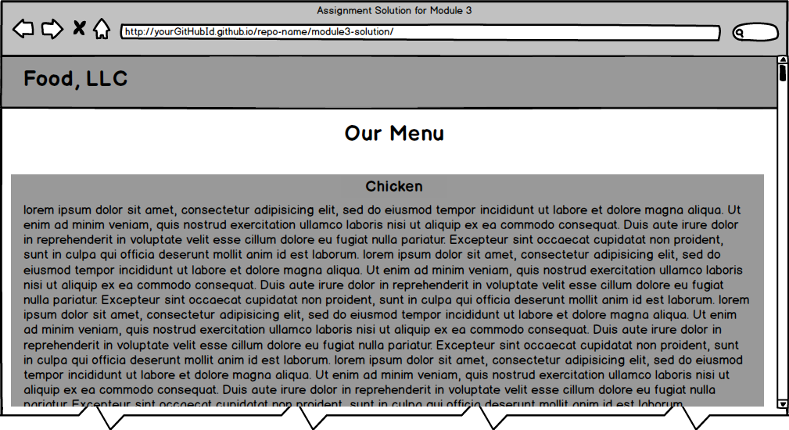
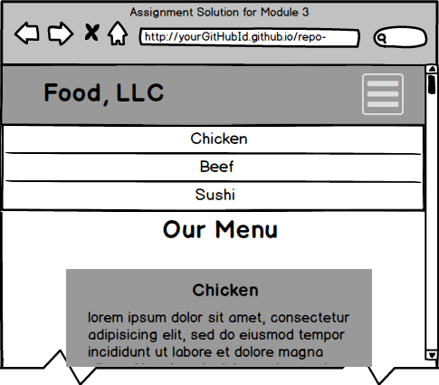
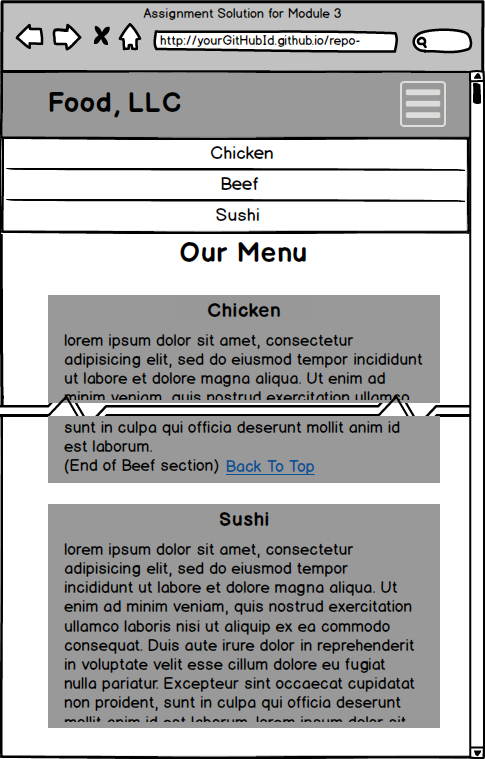

# Module 3 Coding Assignment

Coursera course: [HTML, CSS, and Javascript for Web Developers](https://www.coursera.org/learn/html-css-javascript-for-web-developers)

Woo-hoo! MORE CODING!!! Exciting! :-)

**Time to complete:** About 1 hour or less. **Ask questions in Discussions if you get stuck! We are all learning, and going through getting stuck and then unstuck (even with someone&#39;s help) can be a very valuable learning experience!**

**Don&#39;t get scared by the number of points below.**  **Most of it is NOT graded and is optional for you to try on your own.**

Here is what you will need to complete the assignment:

1. (If you haven&#39;t already) Create a GitHub.com account and a repository that you will use for this class.

2. (If you haven&#39;t already) Follow the Development Setup Video (beginning of Module 1) instructions on how to create a repository and set it up such that you can host and view your finished web pages on GitHub Pages, i.e., GitHub.io domain name. You will need to provide that URL for your peer review.

3. Create a folder in your repository that will serve as a container folder for your solution to this assignment. You can call it whatever you want. For example, &#39;module3-solution&#39; or &#39;mod3\_solution&#39;, etc. Create an &#39;index.html&#39; file inside the solution container folder, e.g., &#39;module3-solution/index.html&#39;.

4. The implementation of the page you will be creating should follow the mockup illustrations shown below. You are provided 3 mockups: desktop and tablet (same), mobile, and mobile with mobile menu dropdown shown. Your implementation has to be JUST 1 page. In other words, you will be creating a single, responsive page.

5. Your page must include a CSS file. No inline styles allowed. Your CSS file should be placed into a &#39;css&#39; folder under the solution container folder, e.g., &#39;module3-solution/css&#39;.

6. For this assignment, you are to use Twitter Bootstrap CSS Framework as much as possible. I suggest you start with copying the starter bootstrap files and folders we discussed in Lecture 25 part 2. If you&#39;ve cloned/downloaded the code example repository, it should be in the &#39;examples/Lecture25&#39; folder. Copy the contents of &#39;examples/Lecture25&#39; to your solution container folder (e.g., &#39;module3-solution&#39;) as a starting point..

7. Since we are using Bootstrap for this assignment, instead of specifying pixel ranges, I will define our desktop, tablet, and mobile views in terms of Bootstrap CSS class prefixes, i.e., &#39;md&#39;, &#39;sm&#39;, and &#39;xs&#39;.
Desktop mockup illustration should correspond to Bootstrap &#39;md&#39;-based classes
Tablet mockup illustration should correspond to Bootstrap &#39;sm&#39;-based classes
Mobile mockup illustration should correspond to Bootstrap &#39;xs&#39;-based classes

8. Navbar: Create a navbar that scrolls away together with the page, i.e., the default one that does not stay in the same place when the page scrolls. The navbar should have a company name (i.e., &#39;navbar-brand&#39; class) called &quot;Food, LLC&quot; that is aligned to the left side of the navbar. (_See_ [h](http://getbootstrap.com/components/#navbar) [ttp://getbootstrap.com/components/#navbar](http://getbootstrap.com/components/#navbar)_. Make the browser window narrower to see the mobile menu button appear in the first example shown at the provided link._)

For desktop and tablet view, the navbar should not contain anything else. No other buttons should be visible. (_Hint: use &#39;visible-xs&#39; class on the button that activates the dropdown._)

9. Navbar - Mobile View: Create a simple menu button (3 horizontal bars). When the user clicks that button, a dropdown menu should appear (as illustrated in Mobile Open Menu illustration below.) The dropdown menu should contain 3 items: Chicken, Beef, and Sushi.

The dropdown menu should take up the entire width of the browser window. Make sure the dropdown menu has a background color set that distinguishes it from the rest of the content.

(_Hint: See_ [_http://getbootstrap.com/components/#navbar_](http://getbootstrap.com/components/#navbar) _and Lecture 31 for examples on how to accomplish this._)

10.  Page Heading. The page heading that says Our Menu should be centered within the browser window. You must use a Bootstrap class to accomplish this.

(_Hint: look for a Bootstrap class that centers text, see_ [_http://getbootstrap.com/css/#type-alignment_](http://getbootstrap.com/css/#type-alignment)_._)

11.  Create a single really tall section that will use the Bootstrap Grid and take up the entire width of the browser window (minus some margins, of course) for all views: desktop, tablet, and mobile. To make the section really tall, you can either fill it out with a LOT of text or simply set its height to something like 1000px. It needs to be tall enough to cause scrolling down to be required to view the bottom of the section. Make sure its background color is set to distinguish it from the rest of the content. (_Hint: don&#39;t forget to have an element with a class=&#39;container&#39; or class=&#39;container-fluid&#39; wrapping your grid. Remember that to have the grid do something &quot;always&quot;, i.e., no matter what browser window size, use the col-xs-... classes. In this case, since we want the section to take up the entire row, use col-xs-12._)

Both the tablet view and the desktop view of what&#39;s graded and required is the same. Here is the mockup illustration of the desktop &amp; tablet version of the site (only required graded parts shown):

 

Here is the mockup illustration of the mobile view (only required graded parts are shown):

 

 

**&#42;&#42;&#42; REQUIRED GRADED ASSIGNMENT ENDS HERE &#42;&#42;&#42;**  
 
 
 
 
**OPTIONAL, UNGRADED PORTION IS BELOW:**

**The rest of this assignment is not graded and is optional, but it&#39;s good practice, so go for it if you have time. The solution to the optional ungraded portion of the assignment below does NOT have to be submitted.**

1. (OPTIONAL, NOT GRADED) Since in this optional part you will be implementing something more complex than a single section in the Bootstrap grid, remove that section before continuing.

2. (OPTIONAL, NOT GRADED) As in previous assignment, the rest of your site is very simple. It consists of a page heading and 3 sections (all in one row in the desktop view). Each section contains some text. You can make it dummy text/&quot;lorem ipsum&quot;, it doesn&#39;t matter. How the sections are laid out on the screen depends on the width of the browser window. (_Hint: use the Bootstrap Grid we discussed in Lecture 26 of Module 2 as well as numerous lectures of Module 3, including Lecture 35._)

3.  (OPTIONAL, NOT GRADED) Each section should be fairly large in height. You can achieve this by either filling it up with a lot of content text or simply setting its height property to something large like 700px. At the end of each section, provide a link that says &quot;Back to Top&quot;. This link should jump the page back to &quot;Our Menu&quot; heading.

(_Hint: use a link that points to a section of the page discussed in Lecture 9 of Module 1._)

4.  (OPTIONAL, NOT GRADED) Each section should have an h3-based section heading which should be centered within the section. Use the same Bootstrap class you used for centering the page heading to center the section heading. Use the heading names shown in the mockup illustrations, i.e., &quot;Chicken&quot;, &quot;Beef&quot;, &quot;Sushi&quot;.

5.  (OPTIONAL, NOT GRADED)Layout: In the desktop view, each of the 3 sections should take up equal amount of space on the screen. As you make the browser window wider or narrower, each section should become wider or narrower.

(_Hint: use &#39;md&#39;-based grid column classes as discussed in Lecture 26 and Lecture 35 among others. It&#39;s a 12 grid-based system, so 3 in a row means each grid will take up 4 grid cells, i.e., &#39;col-md-4&#39;._)
For a visual reference of this view, see the desktop mockup illustration below.

6.  (OPTIONAL, NOT GRADED)Layout: In the tablet view, the first 2 sections should be in the first row and be of equal size. The 3rd section should be in the second row and take up the entire row by itself.

(_Hint: use &#39;sm&#39;-based grid column classes and remember that you don&#39;t really need to define a separate &#39;row&#39; class as you can achieve this layout within a single Bootstrap &#39;row&#39; as discussed in Lecture 26 and Lecture 35, among others. To have 2 sections take up an entire row, i.e., all 12 columns, each one should take up 6 columns. To make the 3rd section take up the entire width of the browser window, i.e., 12 columns, use &#39;col-sm-12&#39;._)
For a visual reference of this view, see the tablet mockup illustration below.

7.  (OPTIONAL, NOT GRADED)Layout: In the mobile view, each section should take up the entire row.

(_Hint: use &#39;xs&#39;-based grid column class. Since you need to take up the entire row, use &#39;col-xs-12&#39;._)
For a visual reference of this view, see the mobile mockup illustration below.

8.  (OPTIONAL, NOT GRADED) Link the menu items &quot;Chicken&quot;, &quot;Beef&quot;, &quot;Sushi&quot; from the mobile-only menu drop down to jump to the part of the page those sections correspond to.

**MOCKUP ILLUSTRATIONS ARE BELOW:**

**Please NOTE: these mockup illustrations show parts that are optional and not graded for this assignment. Please refer to the requirements above to confirm what parts of the mockup are required and graded and what parts are optional.**

Here is the mockup illustration of the desktop version of the site: 

Here is the mockup illustration of the tablet version of the site:   

Here is the mockup illustration of the mobile version of the site with the menu dropdown NOT open (on the left) and menu drop down open (on the right):

